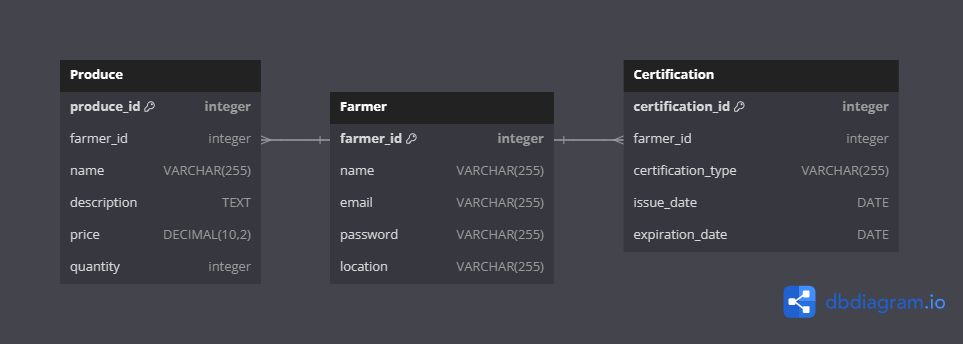

# Database Design Document

## 1. Introduction
### 1.1 Overview of the Project
Nigeria's recent approval of genetically modified (GM) crops has sparked discussions around food security, sustainability, and environmental impact. Eco-Agric, a leading agricultural software company, recognizes the need for a comprehensive solution that addresses these concerns. We are embarking on a new software development sprint to introduce a feature that caters to the needs of our stakeholders, particularly the farmers who grow organic crops.

The new feature will provide farmers with access to a marketplace for their organic produce. Farmers verified to sell non-GMO produce can list their items with a verified or certified badge after certification. While all farmers can list their produce, only those who pass an authentication process will receive an Organic Produce badge.

### 1.2 Purpose of the Database Design Document
The database is designed to:
- Support the marketplace integration feature by structuring data related to farmers, their produce, and certification status.
- Ensure the integrity and reliability of data concerning organic and non-GMO produce listings.
- Facilitate the authentication process for granting Organic Produce badges.

### 1.3 Scope and Objectives
The scope of this document includes the design and implementation of a database system that:
- Manages and stores information about farmers, their produce, and certifications.
- Provides a secure and scalable platform for marketplace transactions.
- Aims to enhance the visibility and accessibility of organic produce in the market.

## 2. System Overview
Eco-Agric's existing system offers a suite of features designed to support agricultural activities and decision-making. The new feature, a marketplace for organic produce, will integrate seamlessly with the current system, providing a dedicated platform for farmers to connect with consumers and sell their organic and non-GMO crops.

## 3. Requirements Analysis
### Functional Requirements
#### Entities:
- **Farmer**: Represents individuals or entities involved in agriculture.
- **Produce**: Encompasses the various crops and products offered by farmers.
- **Certification**: Details the certification process and status for organic produce.

#### Relationships:
- **Farmer-Produces**: A one-to-many relationship indicating that a farmer can produce multiple types of crops.
- **Farmer-Certification**: A one-to-one relationship showing that each farmer can have one certification status.

### Non-functional Requirements
- **Scalability**: The system must handle a growing number of users and listings without degradation in performance.
- **Security**: Robust measures must be in place to protect user data and transactions.
- **Performance**: The system should ensure fast response times and efficient data handling.

## 4. Database Design
### Entity-Relationship Diagram (ERD)
The ERD provided below is a visual representation of the entities and their relationships within the database.


#### Farmer:
- **farmer_id**: Primary key, unique identifier for each farmer.
- **name**: Full name of the farmer.
- **email**: Contact email address.
- **password**: Encrypted password for account security.
- **location**: Geographical location of the farm.

#### Produce:
- **produce_id**: Primary key, unique identifier for each produce item.
- **farmer_id**: Foreign key, links to the farmer who produces the item.
- **name**: Name of the produce.
- **description**: Detailed description of the produce.
- **price**: Price per unit or batch.
- **quantity**: Available quantity for sale.

#### Certification:
- **certification_id**: Primary key, unique identifier for each certification.
- **farmer_id**: Foreign key, links to the certified farmer.
- **certification_type**: Type of certification awarded.
- **issue_date**: Date when the certification was issued.
- **expiration_date**: Date when the certification expires.

## 5. Data Dictionary
The Data Dictionary provides a comprehensive description of the database schema, detailing each table, its attributes, the data types, constraints, and descriptions to ensure clarity and consistency across the system.

### Farmer Table:
- **farmer_id (INT, Primary Key, Auto_increment)**: Unique identifier for each farmer.
- **name (VARCHAR(255), Not Null)**: Full name of the farmer.
- **email (VARCHAR(255), Unique, Not Null)**: Contact email address.
- **password (VARCHAR(255), Not Null)**: Encrypted password for account security.
- **location (VARCHAR(255), Not Null)**: Geographical location of the farm.

### Produce Table:
- **produce_id (INT, Primary Key, Auto_increment)**: Unique identifier for each produce item.
- **farmer_id (INT, Foreign Key, Not Null)**: Links to the farmer who produces the item.
- **name (VARCHAR(255), Not Null)**: Name of the produce.
- **description (TEXT, Not Null)**: Detailed description of the produce.
- **price (DECIMAL(10,2), Not Null)**: Price per unit or batch.
- **quantity (INT, Not Null)**: Available quantity for sale.

### Certification Table:
- **certification_id (INT, Primary Key, Auto_increment)**: Unique identifier for each certification.
- **farmer_id (INT, Foreign Key, Not Null)**: Links to the certified farmer.
- **certification_type (VARCHAR(255), Not Null)**: Type of certification awarded.
- **issue_date (DATE, Not Null)**: Date when the certification was issued.
- **expiration_date (DATE, Not Null)**: Date when the certification expires.

## 6. Database Implementation
The chosen Database Management System (DBMS) is **PostgreSQL** for its robustness and advanced features. Below are the SQL scripts for creating tables, constraints, and relationships, along with sample data for testing purposes.

```sql
-- Farmer Table Creation
CREATE TABLE Farmer (
    farmer_id SERIAL PRIMARY KEY,
    name VARCHAR(255) NOT NULL,
    email VARCHAR(255) UNIQUE NOT NULL,
    password VARCHAR(255) NOT NULL,
    location VARCHAR(255) NOT NULL
);


-- Produce Table Creation
CREATE TABLE Produce (
    produce_id SERIAL PRIMARY KEY,
    farmer_id INT NOT NULL REFERENCES Farmer(farmer_id),
    name VARCHAR(255) NOT NULL,
    description TEXT NOT NULL,
    price DECIMAL(10,2) NOT NULL,
    quantity INT NOT NULL
);

-- Certification Table Creation
CREATE TABLE Certification (
    certification_id SERIAL PRIMARY KEY,
    farmer_id INT NOT NULL REFERENCES Farmer(farmer_id),
    certification_type VARCHAR(255) NOT NULL,
    issue_date DATE NOT NULL,
    expiration_date DATE NOT NULL
);

-- Sample Data Insertion
INSERT INTO Farmer (name, email, password, location) VALUES ('John Doe', 'john.doe@example.com', 'encrypted_password', 'Nigeria');
```

## 7. Security Measures
To protect sensitive data and ensure the integrity of the database, the following security measures are implemented:

- **Encryption:** All sensitive data, such as passwords, are encrypted using advanced hashing algorithms.
- **Access Control:** Role-based access control mechanisms are in place to restrict unauthorized access to the database.
- **Security Audits:** Regular security audits are conducted to identify and rectify potential vulnerabilities.

## 8. Performance Considerations
To ensure optimal performance of the database, the following strategies are employed:

- **Indexing:** Indexes are created on frequently queried columns to speed up search operations.
- **Caching:** Caching mechanisms are implemented to store frequently accessed data in memory, reducing database load.
- **Optimization:** Queries and database structures are continuously optimized for efficient data retrieval.

## 9. Testing Plan
A comprehensive testing plan is developed to validate the functionality and performance of the database:

- **Test Scenarios:** Detailed scenarios are outlined for each requirement to ensure comprehensive coverage.
- **Test Environment Setup:** Steps for setting up dedicated test environments are documented.
- **Validation Criteria:** Expected results for each test case are defined to facilitate result validation.

## 10. Conclusion
This document provides a detailed overview of the database design for Eco-Agric’s new marketplace feature. It outlines the structure, implementation, security, performance, and testing strategies to ensure a robust and efficient system.

### Future Considerations and Enhancements
- **Scalability:** Plans to scale the database to accommodate an increasing number of users and transactions.
- **Feature Expansion:** Potential integration with other agricultural services and platforms.
- **Technology Upgrades:** Continuous evaluation of emerging database technologies for future enhancements.
